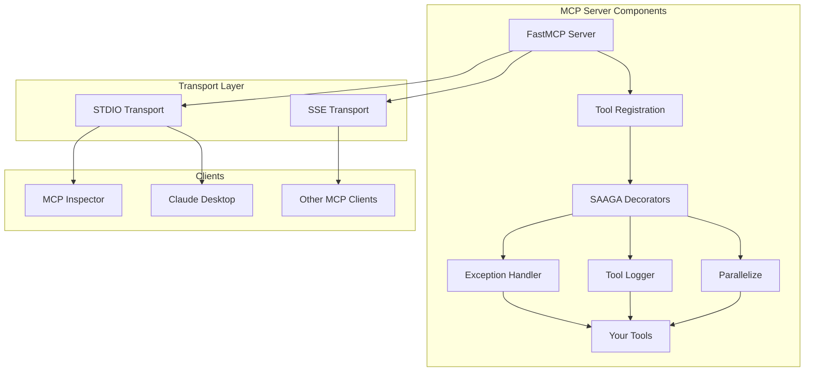
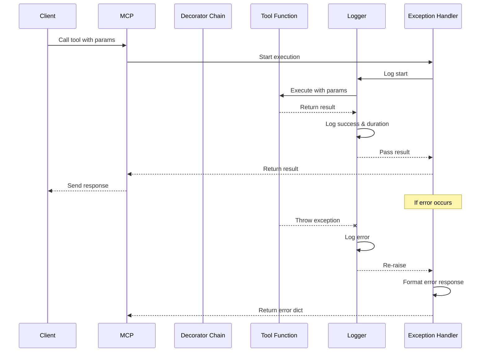
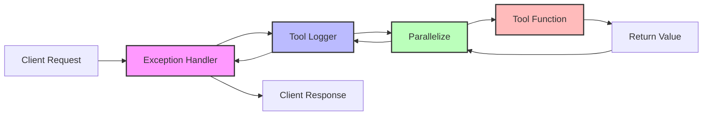

# SAAGA Decorator Patterns for MCP Servers

## Overview

SAAGA decorators provide a powerful pattern for enhancing MCP tools with automatic exception handling, logging, and parallel processing capabilities. This document explains how these decorators work and why the implementation preserves function signatures for proper MCP parameter introspection.

## Architecture Diagrams

### MCP Server Architecture



### Decorator Flow Sequence



## The Challenge: MCP Parameter Introspection

MCP clients (like Claude Desktop and MCP Inspector) need to understand what parameters your tools accept. They do this through introspection - examining the function signature at runtime. If decorators hide the original function signature behind generic `*args, **kwargs`, MCP cannot properly display or validate parameters.

### ❌ The Problem Pattern

```python
def bad_decorator(func):
    def wrapper(**kwargs):  # This hides the original parameters!
        # Do something
        return func(**kwargs)
    return wrapper

@bad_decorator
def my_tool(name: str, count: int) -> str:
    return f"Hello {name}, count: {count}"

# MCP Inspector sees: my_tool(**kwargs) - No parameter information!
```

### ✅ The Solution Pattern

```python
from functools import wraps

def good_decorator(func):
    @wraps(func)  # Preserves the original function signature
    def wrapper(name: str, count: int) -> str:  # But still generic inside
        # Do something
        return func(name, count)
    return wrapper

# Better: Direct registration without wrapper
def apply_decorators_and_register(func, server):
    decorated = exception_handler(func)
    decorated = tool_logger(decorated)
    server.tool()(decorated)  # Register the properly decorated function
```

## SAAGA Decorator Architecture

### 1. Exception Handler Decorator

The exception handler ensures all tools return consistent error responses that MCP clients can understand.

```python
def exception_handler(func):
    """Wraps functions to handle exceptions gracefully."""
    
    if asyncio.iscoroutinefunction(func):
        @wraps(func)
        async def async_wrapper(*args, **kwargs):
            try:
                return await func(*args, **kwargs)
            except Exception as e:
                logger.error(f"Error in {func.__name__}: {e}")
                return {
                    "error": str(e),
                    "tool": func.__name__,
                    "type": type(e).__name__
                }
        return async_wrapper
    else:
        @wraps(func)
        def sync_wrapper(*args, **kwargs):
            try:
                return func(*args, **kwargs)
            except Exception as e:
                logger.error(f"Error in {func.__name__}: {e}")
                return {
                    "error": str(e),
                    "tool": func.__name__,
                    "type": type(e).__name__
                }
        return sync_wrapper
```

**Key Features:**
- Handles both sync and async functions
- Returns structured error responses
- Logs all exceptions
- Preserves function signatures with `@wraps`

### 2. Tool Logger Decorator

Tracks execution time, logs inputs/outputs, and stores metrics in SQLite.

```python
def tool_logger(func, config=None):
    """Enhanced logging for MCP tools."""
    
    if asyncio.iscoroutinefunction(func):
        @wraps(func)
        async def async_wrapper(*args, **kwargs):
            start_time = time.time()
            logger.info(f"Executing tool: {func.__name__}")
            
            try:
                result = await func(*args, **kwargs)
                duration = time.time() - start_time
                logger.info(f"Tool {func.__name__} completed in {duration:.3f}s")
                # TODO: SQLite logging
                return result
            except Exception as e:
                duration = time.time() - start_time
                logger.error(f"Tool {func.__name__} failed after {duration:.3f}s: {e}")
                raise
        return async_wrapper
    # Similar pattern for sync functions...
```

**Key Features:**
- Measures execution time
- Logs all tool invocations
- Captures input parameters and outputs
- Future: SQLite persistence for analysis

### 3. Parallelize Decorator

Enables parallel processing for compute-intensive tools.

```python
def parallelize(func):
    """Enable parallel processing for tools."""
    
    @wraps(func)
    async def wrapper(*args, **kwargs):
        # Determine if the input is parallelizable
        if hasattr(args[0], '__iter__') and not isinstance(args[0], str):
            # Run in parallel
            loop = asyncio.get_event_loop()
            with ThreadPoolExecutor() as executor:
                futures = [
                    loop.run_in_executor(executor, func, item)
                    for item in args[0]
                ]
                results = await asyncio.gather(*futures)
            return results
        else:
            # Run normally
            return await func(*args, **kwargs)
    return wrapper
```

## Decorator Chain Order

The order of decorator application matters:

```python
# Order: exception_handler → tool_logger → parallelize → function
decorated = exception_handler(
    tool_logger(
        parallelize(func)
    )
)
```

### Decorator Chain Visualization



**Why this order?**
1. **Exception handler outermost**: Catches all exceptions, including from other decorators
2. **Logger in middle**: Logs both successes and exceptions
3. **Parallelize innermost**: Closest to the actual function logic

## Registration Pattern

The key to preserving function signatures is our registration approach:

```python
def register_tools(mcp_server: FastMCP, config: ServerConfig) -> None:
    """Register tools with SAAGA decorators."""
    
    # Import decorators
    from decorators import exception_handler, tool_logger, parallelize
    
    # Register regular tools
    for tool_func in example_tools:
        # Apply decorators
        decorated_func = exception_handler(tool_logger(tool_func, config))
        
        # Register directly - no wrapper function!
        mcp_server.tool(
            name=tool_func.__name__,
            description=tool_func.__doc__
        )(decorated_func)
    
    # Register parallel tools
    for tool_func in parallel_example_tools:
        # Apply all three decorators
        decorated_func = exception_handler(
            tool_logger(
                parallelize(tool_func), 
                config
            )
        )
        
        # Register directly
        mcp_server.tool(
            name=tool_func.__name__,
            description=tool_func.__doc__
        )(decorated_func)
```

## Common Pitfalls and Solutions

### Pitfall 1: Factory Functions with Wrappers

```python
# ❌ BAD: Creates a wrapper that hides parameters
def register_tool(func):
    def wrapper(**kwargs):
        decorated = exception_handler(func)
        return decorated(**kwargs)
    server.tool()(wrapper)  # MCP sees wrapper, not func!
```

### Pitfall 2: Not Using @wraps

```python
# ❌ BAD: Loses function metadata
def my_decorator(func):
    def wrapper(*args, **kwargs):
        return func(*args, **kwargs)
    return wrapper  # Lost __name__, __doc__, etc.
```

### Pitfall 3: Async/Sync Confusion

```python
# ❌ BAD: Doesn't handle async functions
def my_decorator(func):
    @wraps(func)
    def wrapper(*args, **kwargs):
        # This breaks for async functions!
        return func(*args, **kwargs)
    return wrapper
```

## Best Practices

1. **Always use `@wraps(func)`** to preserve function metadata
2. **Check `asyncio.iscoroutinefunction(func)`** to handle both sync and async
3. **Register decorated functions directly** without wrapper factories
4. **Apply decorators in correct order** for proper exception handling
5. **Use TypeVar for type hints** to maintain type safety

```python
from typing import TypeVar, Callable, Any

T = TypeVar('T', bound=Callable[..., Any])

def my_decorator(func: T) -> T:
    """Decorator that preserves type hints."""
    # Implementation...
    return cast(T, wrapper)
```

## Testing Your Decorators

Use MCP Inspector to verify your decorators work correctly:

```bash
# In your generated project
mcp dev

# Look for:
# - Correct parameter names (not "kwargs")
# - Proper parameter types
# - Function descriptions
```

## Debugging Tips

1. **Check function signatures:**
   ```python
   import inspect
   print(inspect.signature(my_decorated_function))
   ```

2. **Verify decorator chain:**
   ```python
   print(my_decorated_function.__name__)  # Should be original name
   print(my_decorated_function.__wrapped__)  # Should exist
   ```

3. **Test with MCP Inspector:**
   - Parameters should show actual names
   - Types should be preserved
   - Descriptions should be visible

## Advanced Patterns

### Custom Decorator with Configuration

```python
def configurable_decorator(timeout: int = 30):
    def decorator(func: T) -> T:
        if asyncio.iscoroutinefunction(func):
            @wraps(func)
            async def async_wrapper(*args, **kwargs):
                # Use timeout configuration
                return await asyncio.wait_for(
                    func(*args, **kwargs), 
                    timeout=timeout
                )
            return cast(T, async_wrapper)
        # Handle sync case...
    return decorator

# Usage
@configurable_decorator(timeout=60)
def slow_tool(data: str) -> str:
    # Tool implementation
```

### Combining with FastMCP Decorators

```python
from mcp.server.fastmcp import FastMCP

server = FastMCP("my-server")

# Apply SAAGA decorators first, then FastMCP decorators
decorated = exception_handler(tool_logger(my_tool))
server.tool(
    name="my_tool",
    description="My tool description"
)(decorated)
```

## Conclusion

SAAGA decorators provide powerful functionality while maintaining MCP compatibility through:
- Proper use of `@functools.wraps`
- Direct registration without wrapper factories
- Support for both sync and async functions
- Correct decorator chain ordering

By following these patterns, you get the benefits of automatic exception handling, comprehensive logging, and parallel processing while maintaining full parameter introspection for MCP clients.