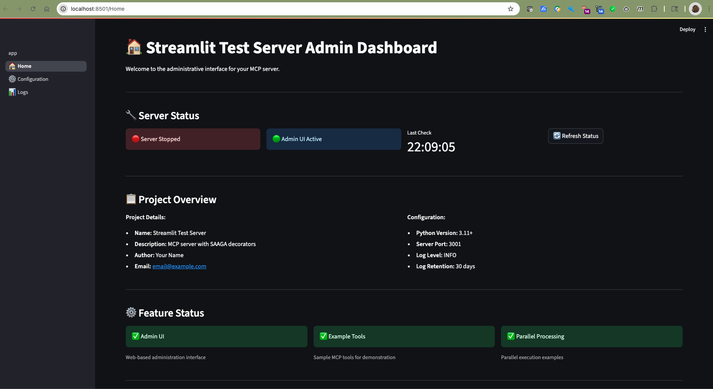
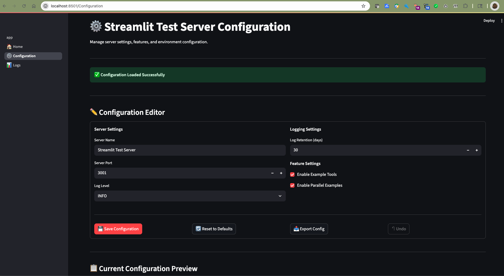
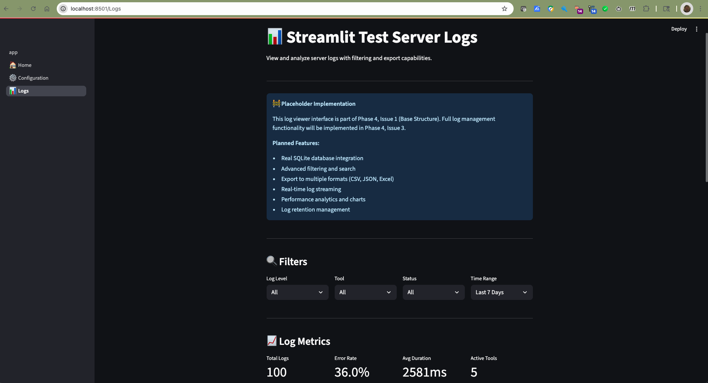

# SAAGA MCP Server Cookie Cutter

A [Cookiecutter](https://github.com/cookiecutter/cookiecutter) template for creating MCP (Model Context Protocol) servers with SAAGA decorators, platform-aware configuration, and optional Streamlit administrative UI.

## Quick Start with AI Assistant

**Want to create a new MCP server?** Have your AI coding assistant guide you through the entire process!

Simply tell your AI assistant: *"I want to create a new MCP server using the SAAGA template. Please read and execute the setup instructions in [SETUP_ASSISTANT_PROMPT.md](SETUP_ASSISTANT_PROMPT.md)"*

This will guide you through:
- Installing cookiecutter
- Generating your new MCP server project
- Understanding the SAAGA decorator patterns
- Setting up your development environment
- Testing with MCP Inspector

## Features

- **FastMCP Integration**: Built on the modern FastMCP framework with dual transport support (stdio/SSE)
- **SAAGA Decorators**: Automatic application of exception handling, logging, and parallelization decorators
- **Platform-Aware Configuration**: Cross-platform configuration management using `platformdirs`
- **Optional Streamlit UI**: Administrative interface for configuration and log viewing
- **SQLite Logging**: Comprehensive logging system with database persistence
- **Developer-Friendly**: Pre-commit hooks, GitHub Actions, and comprehensive documentation

## Quick Start

### Prerequisites

- Python 3.11 or higher
- [Cookiecutter](https://cookiecutter.readthedocs.io/en/latest/installation.html)

### Installation

```bash
pip install cookiecutter
```

### Usage

Generate a new MCP server project:

```bash
cookiecutter https://github.com/SAGAAIDEV/saaga-mcp-server-cookie-cutter.git
```

Or from a local checkout:

```bash
cookiecutter /path/to/saaga-mcp-server-cookie-cutter
```

### Configuration Options

You'll be prompted for the following configuration options:

- `project_name`: Human-readable project name
- `project_slug`: Python package name (auto-generated)
- `description`: Project description
- `author_name`: Your name
- `author_email`: Your email address
- `python_version`: Target Python version (3.11 or 3.12)
- `include_admin_ui`: Include Streamlit administrative UI (yes/no)
- `include_example_tools`: Include example MCP tools (yes/no)
- `include_parallel_example`: Include parallel processing example (yes/no)
- `server_port`: Default server port for HTTP transport
- `log_level`: Default logging level (INFO, DEBUG, WARNING, ERROR)
- `log_retention_days`: Number of days to retain logs

## Example Server Reference Implementation

The `example_server/` directory contains a fully functional MCP server that demonstrates all the features of this template:

- ✅ Working SAAGA decorators with proper parameter introspection
- ✅ Dual transport support (STDIO and SSE)
- ✅ Example tools showing both sync and async patterns
- ✅ Complete configuration management
- ✅ Proper logging setup

### Testing the Example Server

```bash
cd example_server/test_asep40_server
python -m venv .venv
source .venv/bin/activate  # On Windows: .venv\Scripts\activate
pip install -e .

# Test with MCP Inspector
mcp dev test_asep40_server/server/app.py

# Or run directly
python -m test_asep40_server.server.app
```

For detailed testing instructions and examples for each tool in the MCP Inspector, see [MCP_INSPECTOR_TEST_GUIDE.md](docs/MCP_INSPECTOR_TEST_GUIDE.md).

Use the example server as a reference when building your own MCP tools to understand:
- How decorators preserve function signatures
- Proper tool registration patterns
- Configuration management best practices
- Logging and error handling approaches

For detailed information about the decorator patterns, see [DECORATOR_PATTERNS.md](DECORATOR_PATTERNS.md). This documentation is also included in every generated project.

## Generated Project Structure

```
your-project/
├── your_project/
│   ├── __init__.py
│   ├── config.py              # Platform-aware configuration
│   ├── server/
│   │   └── app.py             # FastMCP server with auto-decorators
│   ├── tools/                 # Your MCP tools
│   │   └── example_tools.py   # Example tools (optional)
│   ├── decorators/            # SAAGA decorators
│   │   ├── exceptions.py      # Exception handling
│   │   ├── logging.py         # SQLite logging
│   │   └── parallelize.py     # Parallelization support
│   └── ui/                    # Streamlit admin UI (optional)
│       ├── app.py            # Main UI entry point with navigation
│       ├── pages/            # Multi-page structure
│       │   ├── 1_🏠_Home.py # Dashboard with server status
│       │   ├── 2_⚙️_Configuration.py # Config management
│       │   └── 3_📊_Logs.py # Log viewer and analysis
│       └── lib/              # Shared UI components
│           ├── components.py # Reusable UI elements
│           ├── styles.py     # CSS and theming
│           └── utils.py      # Helper functions
├── tests/                     # Test suite
├── docs/                      # Documentation
│   └── DECORATOR_PATTERNS.md # Detailed decorator guidance
├── .ai-prompts.md            # AI assistant context
├── pyproject.toml            # Project configuration
├── README.md                 # Project documentation
├── .gitignore               # Git ignore rules
└── LICENSE                  # MIT license
```

## Key Features

### SAAGA Decorators

The template automatically applies three key decorators to your MCP tools:

1. **Exception Handler**: Graceful error handling with logging
2. **Tool Logger**: Comprehensive logging to SQLite database
3. **Parallelize**: Optional parallel processing for compute-intensive tools

### Platform-Aware Configuration

Configuration files are automatically placed in appropriate locations:
- macOS: `~/Library/Application Support/your-project/`
- Linux: `~/.local/share/your-project/`
- Windows: `%APPDATA%/your-project/`

### Optional Streamlit Admin UI

When `include_admin_ui=yes`, the template generates a comprehensive web-based administrative interface:

#### Dashboard


The dashboard provides real-time server status monitoring, project information, and quick access to common actions.

#### Configuration Editor


The configuration page allows you to edit server settings, with features like:
- Real-time validation
- Diff preview showing changes
- Export/import functionality (JSON & YAML)
- Reset to defaults with confirmation

#### Log Viewer


The logs page provides comprehensive log analysis with:
- Date range filtering
- Status filtering (success/error)
- Tool-specific filtering
- Export capabilities

#### Features
- **🏠 Dashboard**: Server status monitoring, project information, and quick actions
- **⚙️ Configuration**: Server configuration management with validation and diff preview
- **📊 Logs**: Log viewer with advanced filtering and export capabilities
- **🎨 Modern UI**: Professional interface with custom CSS and responsive design
- **🔄 Real-time Status**: Live server monitoring via port checking
- **🛡️ Error Handling**: Graceful degradation and fallback modes

#### Running the Admin UI

After generating your project with `include_admin_ui=yes`:

```bash
# Install your project
cd your-project
python -m venv .venv
source .venv/bin/activate  # On Windows: .venv\Scripts\activate
pip install -e .

# Start the admin UI
streamlit run your_project/ui/app.py

# In another terminal, start your MCP server (for status monitoring)
python -m your_project --transport sse --port 3001
```

The admin UI will be available at `http://localhost:8501` and can monitor your MCP server running on port 3001.

#### UI Structure

```
ui/
├── app.py              # Main Streamlit entry point with navigation
├── pages/              # Multi-page structure
│   ├── 1_🏠_Home.py   # Dashboard with server status
│   ├── 2_⚙️_Configuration.py  # Config management
│   └── 3_📊_Logs.py   # Log viewer with filtering
└── lib/               # Shared utilities
    ├── components.py  # Reusable UI components
    ├── styles.py      # CSS styling and themes
    └── utils.py       # Helper functions and server status checks
```

#### Independent Operation

The admin UI works independently of the MCP server:
- ✅ **Server Running**: Shows real-time status and monitoring
- ✅ **Server Stopped**: Functions with fallback data and placeholders
- ✅ **Standalone Mode**: All UI features work without server dependencies

## Development

### Setting Up for Development

1. Clone this repository
2. Install dependencies: `pip install -r requirements.txt`
3. Install pre-commit hooks: `pre-commit install`

### Testing

Run the test suite:

```bash
pytest tests/
```

Test template generation:

```bash
cookiecutter . --no-input
```

### Contributing

Please read [CONTRIBUTING.md](CONTRIBUTING.md) for details on our code of conduct and the process for submitting pull requests.

## Architecture

### MCP Server Lifecycle

MCP servers are launched by MCP clients (Claude Desktop, Cursor, etc.) through configuration. The generated server:

1. Loads configuration from platform-specific locations
2. Applies SAAGA decorators automatically
3. Registers tools with the FastMCP framework
4. Handles client connections via stdio or SSE transport

### Decorator Application Pattern

```python
def create_decorated_server(name, tools, parallel_tools):
    server = FastMCP(name)
    
    # Regular tools: exception_handler → tool_logger
    for func in tools:
        decorated = exception_handler(func)
        decorated = tool_logger(decorated)
        server.tool()(decorated)
    
    # Parallel tools: exception_handler → tool_logger → parallelize
    for func in parallel_tools:
        decorated = exception_handler(func)
        decorated = tool_logger(decorated)
        decorated = parallelize(decorated)
        server.tool()(decorated)
    
    return server
```

## Examples

### Basic MCP Tool

```python
from your_project.server.app import server

@server.tool
def example_tool(message: str) -> str:
    """Example MCP tool with automatic decorators."""
    return f"Processed: {message}"
```

### Parallel Processing Tool

```python
from your_project.server.app import server

@server.tool
def compute_intensive_tool(data: list) -> list:
    """Tool that will be automatically parallelized."""
    # This tool will be wrapped with the parallelize decorator
    return [expensive_computation(item) for item in data]
```

## License

This project is licensed under the MIT License - see the [LICENSE](LICENSE) file for details.

## Acknowledgments

- [FastMCP](https://github.com/jlowin/fastmcp) for the excellent MCP framework
- [Cookiecutter](https://github.com/cookiecutter/cookiecutter) for the templating system
- [SAAGA](https://github.com/SAGAAIDEV) for the decorator patterns