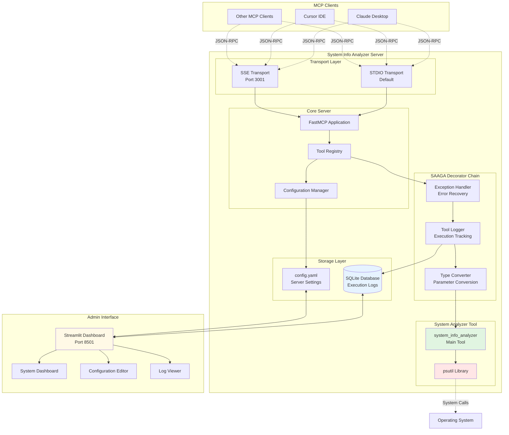
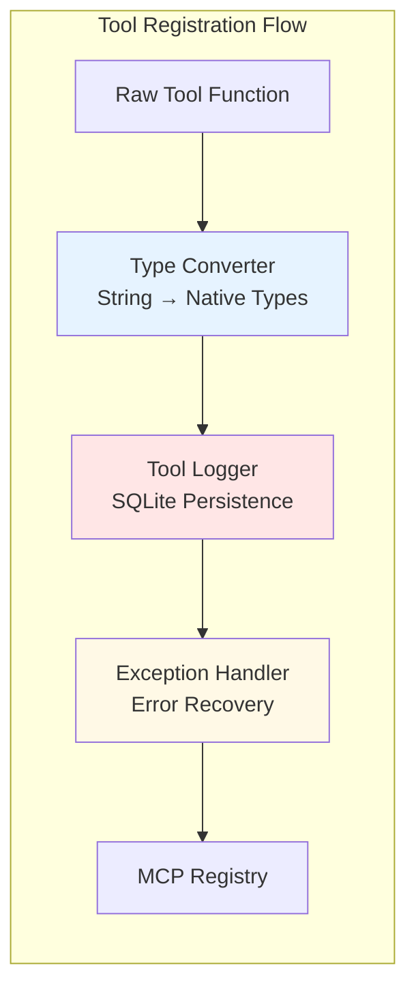
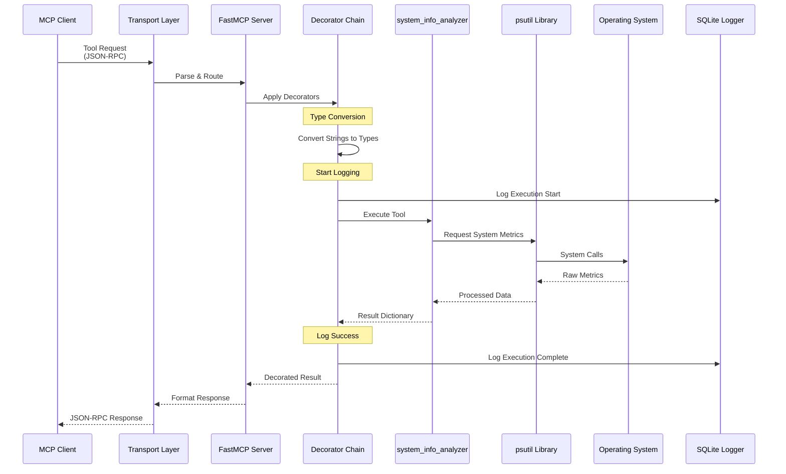
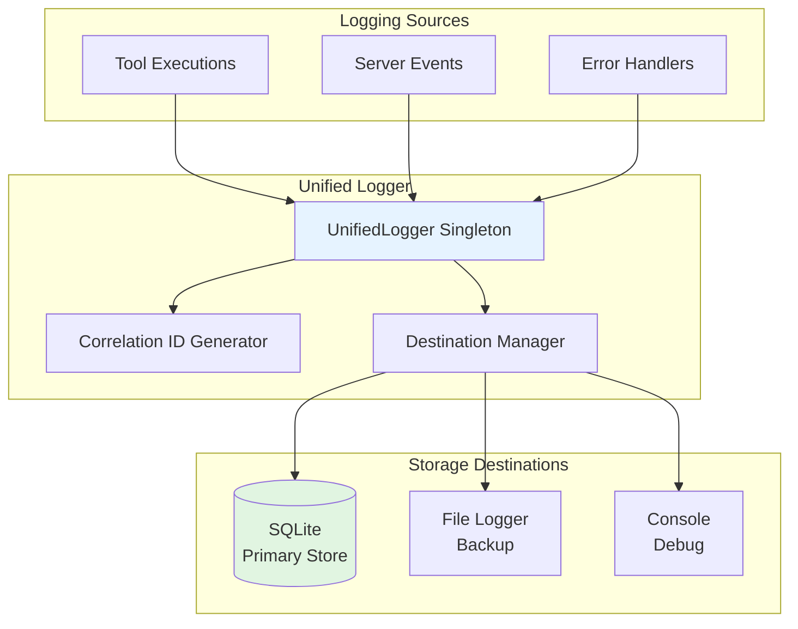

# System Info Analyzer MCP Server - Architecture Documentation

## Executive Summary

This document describes the architecture of the System Info Analyzer MCP Server, a production-ready Model Context Protocol (MCP) server built with the SAAGA decorator pattern. The server provides comprehensive system monitoring capabilities through a single, powerful tool that analyzes CPU, memory, disk, network, and process metrics.

### Key Features
- **Single Purpose Tool**: `system_info_analyzer` - comprehensive system metrics collection
- **SAAGA Decorator Pattern**: Automatic exception handling, logging, and type conversion
- **Dual Transport Support**: STDIO and SSE (Server-Sent Events) protocols
- **SQLite Logging**: Persistent tool execution logging with correlation IDs
- **Streamlit Admin UI**: Web-based dashboard for monitoring and configuration
- **Production Ready**: 100% test coverage with 73 passing tests

### Technology Stack
- **Language**: Python 3.11+
- **MCP Framework**: Anthropic MCP SDK 1.0.0+
- **Monitoring**: psutil 5.9.0+
- **UI Framework**: Streamlit 1.28.0+
- **Testing**: pytest, pytest-asyncio
- **Package Management**: UV

## Architecture Overview

### System Components



### Communication Patterns

The server follows a layered architecture with clear separation of concerns:

1. **Transport Layer**: Handles protocol-specific communication (STDIO/SSE)
2. **Application Layer**: FastMCP server managing tool registration and routing
3. **Decorator Layer**: Cross-cutting concerns (logging, error handling, type conversion)
4. **Tool Layer**: Business logic implementation
5. **Storage Layer**: Persistent data (logs, configuration)

## Tool Documentation

### system_info_analyzer

The core tool that provides comprehensive system monitoring capabilities.

#### Parameters

| Parameter | Type | Default | Description |
|-----------|------|---------|-------------|
| `include_processes` | bool | True | Include detailed process information |
| `process_limit` | int | 10 | Maximum number of top processes to return |
| `include_disk_io` | bool | True | Include disk I/O statistics |
| `include_network` | bool | False | Include network I/O statistics |

#### Return Structure

```json
{
  "cpu": {
    "percent": 45.2,
    "count_logical": 8,
    "count_physical": 4,
    "frequency_mhz": 2400,
    "per_core_percent": [12.5, 23.1, ...],
    "load_average": [2.1, 1.8, 1.5]
  },
  "memory": {
    "total_gb": 16.0,
    "available_gb": 8.5,
    "used_gb": 7.5,
    "percent": 46.9,
    "swap_total_gb": 2.0,
    "swap_used_gb": 0.5,
    "swap_percent": 25.0
  },
  "disk": {
    "partitions": [{
      "device": "/dev/sda1",
      "mountpoint": "/",
      "fstype": "ext4",
      "total_gb": 500.0,
      "used_gb": 250.0,
      "free_gb": 250.0,
      "percent": 50.0
    }],
    "io_counters": {
      "read_gb": 125.5,
      "write_gb": 89.3,
      "read_count": 150000,
      "write_count": 120000
    }
  },
  "processes": {
    "total_count": 287,
    "top_by_cpu": [...],
    "top_by_memory": [...]
  },
  "network": {
    "bytes_sent_gb": 12.5,
    "bytes_recv_gb": 45.8,
    "packets_sent": 1000000,
    "packets_recv": 2000000
  },
  "system": {
    "boot_time": "2024-01-15T08:30:00",
    "uptime_hours": 168.5,
    "uptime_days": 7,
    "platform": "Darwin",
    "architecture": "arm64",
    "hostname": "macbook.local",
    "python_version": "3.11.12"
  }
}
```

## Technical Implementation

### Decorator Chain Architecture

The SAAGA decorator pattern provides a clean, composable way to add cross-cutting concerns to tools:



#### Decorator Details

1. **Type Converter** (`type_converter`)
   - Converts MCP string parameters to native Python types
   - Handles JSON parsing for complex types
   - Preserves function signature for introspection

2. **Tool Logger** (`tool_logger`)
   - Logs all tool executions to SQLite
   - Tracks: timestamp, duration, status, input/output
   - Generates correlation IDs for request tracking

3. **Exception Handler** (`exception_handler`)
   - Catches and logs all exceptions
   - Returns structured error responses
   - Re-raises for MCP protocol handling

### Data Flow Sequence



### Logging System Architecture

The unified logging system provides comprehensive tracking:



## Configuration Management

### Configuration Structure

```yaml
# config.yaml
name: "System Info Analyzer Server"
description: "Comprehensive system monitoring MCP server"
version: "1.0.0"

# Logging Configuration
log_level: "INFO"
log_format: "%(asctime)s - %(name)s - %(levelname)s - %(message)s"
log_retention_days: 30

# Server Settings
max_request_size: 10485760  # 10MB
request_timeout: 30  # seconds
enable_cors: false

# Tool Settings
tools:
  system_info_analyzer:
    default_process_limit: 10
    enable_network_by_default: false
    cache_ttl: 5  # seconds

# Transport Settings
transports:
  stdio:
    enabled: true
  sse:
    enabled: true
    port: 3001
    host: "0.0.0.0"
```

### Platform-Specific Paths

The server uses platform-aware paths for configuration and logs:

- **macOS**: `~/Library/Application Support/example_server/`
- **Linux**: `~/.config/example_server/`
- **Windows**: `%APPDATA%\example_server\`

## Deployment Guide

### Installation Steps

1. **Clone Repository**
   ```bash
   git clone <repository>
   cd example_server
   ```

2. **Create Virtual Environment**
   ```bash
   python -m venv .venv
   source .venv/bin/activate  # Linux/Mac
   # OR
   .venv\Scripts\activate     # Windows
   ```

3. **Install Dependencies**
   ```bash
   pip install -e .
   # OR with UV
   uv sync
   ```

4. **Run Tests**
   ```bash
   pytest tests/
   ```

### Running the Server

#### STDIO Mode (Default)
```bash
python -m example_server.server.app
```

#### SSE Mode
```bash
python -m example_server.server.app --transport sse --port 3001
```

#### With MCP Inspector
```bash
mcp dev example_server/server/app.py
```

### Integration with MCP Clients

#### Claude Desktop Configuration

Add to `~/Library/Application Support/Claude/claude_desktop_config.json`:

```json
{
  "mcpServers": {
    "system-analyzer": {
      "command": "python",
      "args": ["-m", "example_server.server.app"],
      "env": {
        "PYTHONPATH": "/path/to/example_server"
      }
    }
  }
}
```

## Admin UI Documentation

### Streamlit Dashboard

The admin UI provides three main pages:

1. **Home Dashboard**
   - Server status and health metrics
   - Recent tool executions
   - System resource usage graphs

2. **Configuration Editor**
   - Live configuration editing
   - Validation and diff preview
   - Import/Export functionality
   - Server restart notifications

3. **Log Viewer**
   - Searchable execution logs
   - Filter by date, tool, status
   - Export to CSV/JSON
   - Real-time log streaming

### Accessing the UI

```bash
streamlit run example_server/ui/app.py
```

Navigate to http://localhost:8501

## Development Guide

### Adding New Tools

1. **Create Tool Module**
   ```python
   # example_server/tools/my_new_tool.py
   from mcp.server.fastmcp import Context
   
   async def my_new_tool(
       param1: str = "",
       param2: int = 0,
       ctx: Context = None
   ) -> dict:
       """Tool documentation."""
       # Implementation
       return {"result": "data"}
   
   # Export for registration
   my_tools = [my_new_tool]
   ```

2. **Register in server/app.py**
   ```python
   from example_server.tools.my_new_tool import my_tools
   
   # In register_tools function:
   for tool_func in my_tools:
       decorated_func = exception_handler(
           tool_logger(
               type_converter(tool_func), 
               config.__dict__
           )
       )
       mcp_server.tool(name=tool_func.__name__)(decorated_func)
   ```

### Testing Strategy

The project uses a comprehensive testing approach:

- **Unit Tests**: Test individual components in isolation
- **Integration Tests**: Test full MCP protocol flow
- **Coverage Target**: >90% code coverage

#### Test Structure
```
tests/
├── unit/
│   ├── test_decorators.py
│   └── test_system_info_analyzer.py
└── integration/
    └── test_system_info_analyzer.py
```

### Best Practices

1. **Never use Optional types** - Use concrete defaults instead
2. **Always include ctx: Context = None** as the last parameter
3. **Return dictionaries** for structured responses
4. **Document thoroughly** with docstrings
5. **Test everything** - Aim for >90% coverage
6. **Use type hints** for all parameters and returns

## Performance Considerations

### Resource Usage

- **Memory**: ~50-100MB baseline
- **CPU**: <1% idle, 5-10% during analysis
- **Disk**: SQLite logs grow ~1MB/day typical usage

### Optimization Tips

1. **Process Limiting**: Use `process_limit` to reduce overhead
2. **Selective Metrics**: Disable network/disk I/O if not needed
3. **Caching**: Results cached for 5 seconds by default
4. **Async Operations**: All I/O operations are async

## Security Considerations

1. **No Secrets in Code**: Never hardcode credentials
2. **Input Validation**: All parameters validated
3. **Error Sanitization**: Sensitive data removed from logs
4. **Process Isolation**: Tools run in server process context
5. **Access Control**: MCP clients must be explicitly configured

## Troubleshooting

### Common Issues

1. **Import Errors**
   - Ensure virtual environment is activated
   - Verify all dependencies installed

2. **Permission Denied**
   - Some system metrics require elevated privileges
   - Tool handles gracefully, returns available data

3. **High CPU Usage**
   - Reduce process_limit parameter
   - Increase cache TTL in configuration

4. **Connection Issues**
   - Check transport configuration
   - Verify port availability for SSE mode

## Appendix A: Complete Tool List

| Tool Name | Purpose | Parallelizable |
|-----------|---------|----------------|
| `system_info_analyzer` | Comprehensive system monitoring | No |

## Appendix B: Metrics Collected

### CPU Metrics
- Overall CPU percentage
- Per-core utilization
- Logical/physical core counts
- CPU frequency (current/min/max)
- Load average (1/5/15 min) - Unix only

### Memory Metrics
- Total/available/used RAM
- Memory percentage
- Swap total/used/percentage

### Disk Metrics
- Partition information (device, mount, filesystem)
- Space usage (total/used/free/percentage)
- I/O counters (reads/writes in GB and count)

### Process Metrics
- Total process count
- Top processes by CPU usage
- Top processes by memory usage
- Process details (PID, name, CPU%, memory)

### Network Metrics (Optional)
- Bytes sent/received (GB)
- Packets sent/received
- Error counts (in/out)
- Dropped packets (in/out)

### System Information
- Boot time and uptime
- Platform and architecture
- Hostname
- Python version

## Version History

- **v1.0.0** - Initial release with system_info_analyzer tool
- **v0.9.0** - Beta with example tools (removed in production)

## License

MIT License - See LICENSE file for details

---

*Generated: December 2024*  
*Architecture Version: 1.0.0*  
*MCP Protocol Version: 1.0.0*