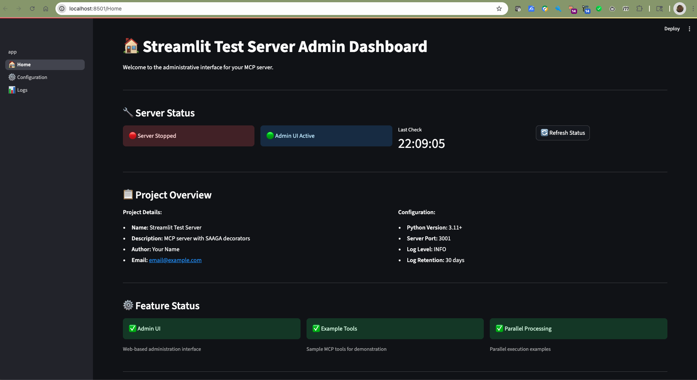
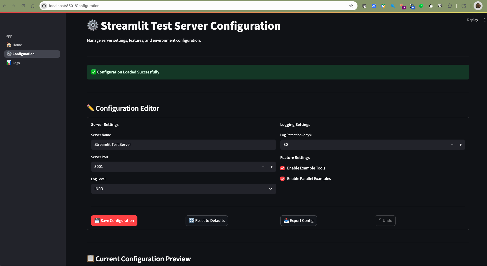
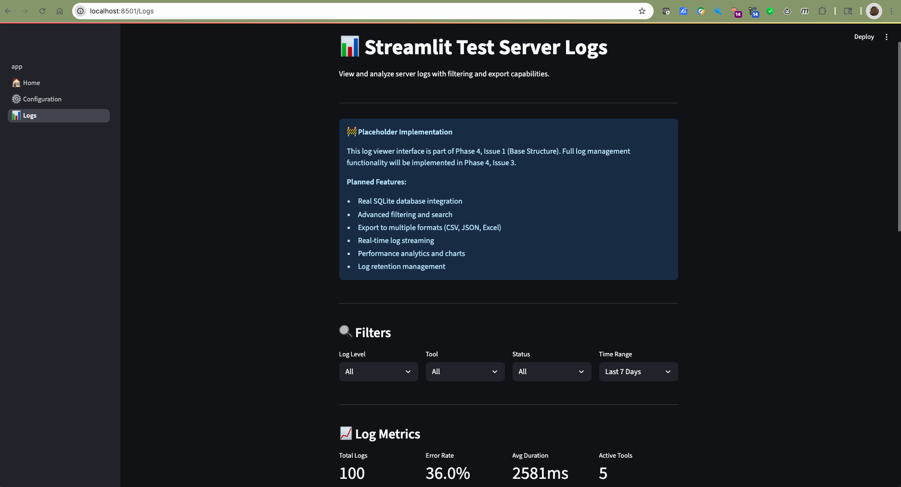

# Example MCP Server

Example server demonstrating SAAGA decorators

## Quick Start with AI Assistant

**Need help getting started?** Have your AI coding assistant guide you!

Simply tell your AI assistant: *"I have a Example MCP Server project. Please read and follow [WORKING_WITH_SAAGA_PROMPT.md](WORKING_WITH_SAAGA_PROMPT.md) to help me understand and work with this MCP server."*

**For quick reference**, the [.ai-prompts.md](.ai-prompts.md) file contains a condensed version of key patterns.

**For detailed technical documentation**, see [docs/DECORATOR_PATTERNS.md](docs/DECORATOR_PATTERNS.md).

## Overview

This MCP server was generated using the SAAGA MCP Server Cookie Cutter template. It includes:

- **FastMCP Integration**: Modern MCP framework with dual transport support
- **SAAGA Decorators**: Automatic exception handling, logging, and parallelization
- **Platform-Aware Configuration**: Cross-platform configuration management
- **Streamlit Admin UI**: Web-based configuration and monitoring interface
- **SQLite Logging**: Comprehensive logging with database persistence

## Installation

### Prerequisites

- Python 3.11 or higher
- pip (Python package manager)

### Install from Source

```bash
git clone <your-repository-url>
cd example_mcp_server
pip install -e .
```

### Development Installation

```bash
git clone <your-repository-url>
cd example_mcp_server
pip install -e ".[dev]"
```

## Usage

### Running the MCP Server

The server can be run in two modes:

#### 1. STDIO Mode (for MCP clients like Claude Desktop)

```bash
# Run with default settings
python -m example_mcp_server.server.app

# Run with custom log level
python -m example_mcp_server.server.app --log-level DEBUG

# Run the server directly
python example_mcp_server/server/app.py
```

#### 2. SSE Mode (for web-based clients)

```bash
# Run with SSE transport
python -m example_mcp_server.server.app --transport sse --port 3001

# Run with custom host and port
python -m example_mcp_server.server.app --transport sse --host 0.0.0.0 --port 8080
```

### Command Line Options

```bash
python -m example_mcp_server.server.app --help
```

Available options:
- `--transport`: Choose between "stdio" (default) or "sse"
- `--host`: Host to bind to for SSE transport (default: 127.0.0.1)
- `--port`: Port to bind to for SSE transport (default: 3001)
- `--log-level`: Logging level - DEBUG, INFO, WARNING, ERROR (default: INFO)

### MCP Client Configuration

#### Claude Desktop Configuration

Add the following to your Claude Desktop MCP settings (`claude_desktop_config.json`):

```json
{
  "mcpServers": {
    "example_mcp_server": {
      "command": "python",
      "args": ["-m", "example_mcp_server.server.app"]
    }
  }
}
```

#### Advanced Configuration Options

```json
{
  "mcpServers": {
    "example_mcp_server": {
      "command": "python",
      "args": [
        "-m", "example_mcp_server.server.app",
        "--log-level", "DEBUG"
      ],
      "env": {
        "PYTHONPATH": "/path/to/your/project"
      }
    }
  }
}
```

#### Using with Virtual Environment

```json
{
  "mcpServers": {
    "example_mcp_server": {
      "command": "/path/to/your/venv/bin/python",
      "args": ["-m", "example_mcp_server.server.app"]
    }
  }
}
```

#### Configuration File Locations

- **macOS**: `~/Library/Application Support/Claude/claude_desktop_config.json`
- **Linux**: `~/.config/Claude/claude_desktop_config.json`
- **Windows**: `%APPDATA%/Claude/claude_desktop_config.json`

### Admin UI

Launch the Streamlit admin interface:

```bash
streamlit run example_mcp_server/ui/app.py
```

#### Dashboard


The dashboard provides:
- Real-time server status monitoring
- Project information and configuration overview
- Quick access to common actions
- System resource usage

#### Configuration Editor


The configuration editor features:
- Live configuration editing with validation
- Diff preview showing pending changes
- Export/import functionality (JSON & YAML formats)
- Reset to defaults with confirmation dialog
- Automatic server restart notifications

#### Log Viewer


The log viewer includes:
- Date range filtering for historical analysis
- Status filtering (success/error/all)
- Tool-specific filtering
- Export capabilities for further analysis
- Real-time log updates

## AI Assistant Instructions

When working with this Example MCP Server MCP server in an AI coding assistant (like Claude, Cursor, or GitHub Copilot):

### Understanding the Server Architecture

This server uses SAAGA decorators that automatically wrap all MCP tools with:
- **Exception handling**: All errors are caught and returned as structured error responses
- **Comprehensive logging**: All tool invocations are logged with timing and parameters
- **Optional parallelization**: Tools marked for parallel execution run concurrently

### Key Points for AI Assistants

1. **Tool Registration Pattern**: Tools are registered with decorators already applied. Do NOT manually wrap tools with decorators - this is handled automatically in `server/app.py`.

2. **Parameter Types**: MCP passes all parameters as strings from the client. Ensure your tools handle type conversion:
   ```python
   def my_tool(count: str) -> dict:
       # Convert string to int
       count_int = int(count)
       return {"result": count_int * 2}
   ```

3. **Error Handling**: Tools can raise exceptions freely - the exception_handler decorator will catch them and return proper error responses.

4. **Async Support**: Both sync and async tools are supported. The decorators automatically detect and handle both patterns.

5. **Logging**: Check logs at the platform-specific data directory for debugging:
   - macOS: `~/Library/Application Support/example_mcp_server/logs.db`
   - Linux: `~/.local/share/example_mcp_server/logs.db`
   - Windows: `%APPDATA%/example_mcp_server/logs.db`

### Common Tasks

**Adding a new tool:**
```python
# In example_mcp_server/tools/my_new_tool.py
def my_new_tool(param: str) -> dict:
    """Description of what this tool does."""
    # Implementation
    return {"result": "processed"}

# In example_mcp_server/tools/__init__.py
from .my_new_tool import my_new_tool
example_tools.append(my_new_tool)
```

**Testing with MCP Inspector:**
```bash
# From the project root
mcp dev example_mcp_server/server/app.py
```

**Debugging a tool:**
1. Check the SQLite logs for error messages
2. Run with `--log-level DEBUG` for verbose output
3. Test directly with MCP Inspector to see parameter handling

### Important Implementation Notes

- The server uses the standard MCP SDK (`from mcp.server.fastmcp import FastMCP`)
- Function signatures are preserved through careful decorator implementation
- The `register_tools()` function in `server/app.py` handles all decorator application
- Tools should return JSON-serializable Python objects (dict, list, str, int, etc.)

## Configuration

Configuration files are stored in platform-specific locations:
- **macOS**: `~/Library/Application Support/example_mcp_server/`
- **Linux**: `~/.local/share/example_mcp_server/`
- **Windows**: `%APPDATA%/example_mcp_server/`

### Configuration Options

- `log_level`: Logging level (INFO)
- `log_retention_days`: Days to retain logs (30)
- `server_port`: HTTP server port (3001)

## Development

### Project Structure

```
example_mcp_server/
├── example_mcp_server/
│   ├── config.py              # Platform-aware configuration
│   ├── server/
│   │   └── app.py             # FastMCP server with decorators
│   ├── tools/                 # Your MCP tools
│   ├── decorators/            # SAAGA decorators
│   └── ui/                    # Streamlit admin UI
├── tests/                     # Test suite
├── docs/                      # Documentation
└── pyproject.toml            # Project configuration
```

### Adding New Tools

1. Create a new Python file in `example_mcp_server/tools/`
2. Define your tool function
3. Import and register it in `server/app.py`

Example:

```python
# example_mcp_server/tools/my_tool.py
def my_tool(message: str) -> str:
    """Example MCP tool."""
    return f"Processed: {message}"

# The server will automatically apply SAAGA decorators
```

### Running Tests

```bash
pytest tests/
```

### Code Quality

This project uses several code quality tools:

```bash
# Format code
black example_mcp_server/
isort example_mcp_server/

# Lint code
flake8 example_mcp_server/
mypy example_mcp_server/
```

## SAAGA Decorators

This server automatically applies three key decorators to your MCP tools:

1. **Exception Handler**: Graceful error handling with logging
2. **Tool Logger**: Comprehensive logging to SQLite database
3. **Parallelize**: Optional parallel processing for compute-intensive tools

## Logging

Logs are stored in a SQLite database with the following schema:
- `timestamp`: When the tool was called
- `tool_name`: Name of the MCP tool
- `duration_ms`: Execution time in milliseconds
- `status`: Success/failure status
- `input_args`: Tool input arguments
- `output_summary`: Summary of tool output
- `error_message`: Error details (if any)

## Contributing

1. Fork the repository
2. Create a feature branch
3. Make your changes
4. Add tests for new functionality
5. Run the test suite
6. Submit a pull request

## License

This project is licensed under the MIT License - see the [LICENSE](LICENSE) file for details.

## Support

For issues and questions:
- Create an issue on GitHub
- Check the documentation in the `docs/` directory
- Review the test suite for usage examples

## Acknowledgments

- [FastMCP](https://github.com/jlowin/fastmcp) for the MCP framework
- [SAAGA](https://github.com/SAGAAIDEV) for the decorator patterns
- [Cookiecutter](https://github.com/cookiecutter/cookiecutter) for the templating system