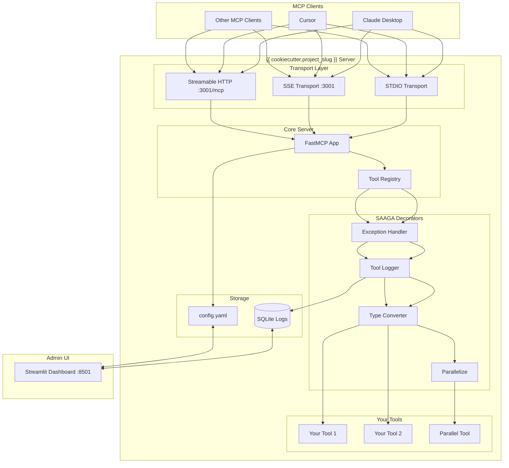
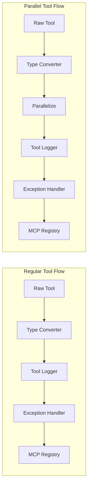
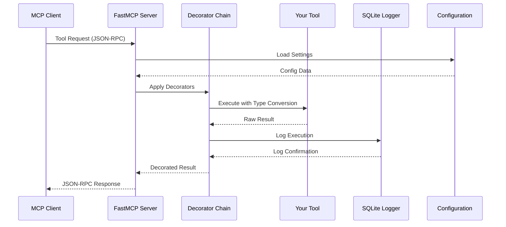

# Generate Architecture Documentation

I'll analyze your MCP server's current state and create comprehensive design documentation with diagrams.

## Step 1: Discover Project Structure

First, let me understand your project:

```bash
pwd
ls -la {{ cookiecutter.project_slug }}/
```

Analyzing:
- Tools implemented
- Decorators in use
- Configuration structure
- UI components (if enabled)
- Test coverage

## Step 2: Analyze Tools

Let me examine your tools:

```bash
ls -la {{ cookiecutter.project_slug }}/tools/
```

Reading each tool file to understand:
- Tool purposes and parameters
- Return types and error handling
- Parallelization usage
- Dependencies

## Step 3: Analyze Architecture Components

Examining:
- **Server Configuration**: How `server/app.py` orchestrates everything
- **Decorator Chain**: How SAAGA decorators are applied
- **Logging System**: SQLite logging and correlation IDs
- **Transport Layers**: STDIO, SSE, and Streamable HTTP support
- **UI Integration**: Streamlit admin interface (if present)

## Step 4: Generate Architecture Diagrams

### 4.1 System Overview Diagram



### 4.2 Decorator Chain Diagram



### 4.3 Data Flow Diagram



## Step 5: Generate Documentation

Creating comprehensive documentation at: `$ARGUMENTS` (or `ARCHITECTURE.md` if not specified)

The document will include:

1. **Executive Summary**
   - Project overview
   - Key features
   - Technology stack

2. **Architecture Overview**
   - System components
   - Communication patterns
   - Data flow

3. **Tools Documentation**
   - Available tools
   - Parameters and return types
   - Usage examples

4. **Technical Details**
   - Decorator implementation
   - Logging system
   - Configuration management
   - Error handling

5. **Deployment Guide**
   - Installation steps
   - Configuration options
   - Integration with MCP clients

6. **Development Guide**
   - Adding new tools
   - Testing approach
   - Best practices

7. **Diagrams**
   - System architecture
   - Decorator chain
   - Data flow
   - Component interactions

## Step 6: Create the Document

Generating the markdown file with:
- Embedded Mermaid diagrams
- Code examples from actual implementation
- Configuration samples
- API documentation

## Step 7: Generate Diagram Images

Creating PNG versions of diagrams for better portability:

```bash
# Creating architecture diagrams as images
mcp__mermaid_image_generator__generate_mermaid_diagram_file
```

Diagrams saved to `docs/diagrams/` directory.

## ✅ Documentation Complete!

Generated files:
- **Main document**: `ARCHITECTURE.md` (or your specified filename)
- **Diagram images**: `docs/diagrams/*.png`

The documentation includes:
- Complete architecture overview
- All tools documented
- Visual diagrams (both Mermaid and PNG)
- Configuration reference
- Integration guides

You can now:
1. Share this with your team
2. Include in your repository
3. Use for onboarding
4. Reference during development

The documentation reflects the CURRENT state of your MCP server!