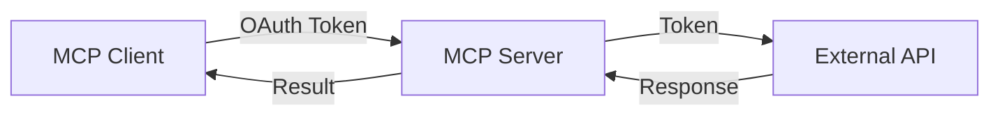
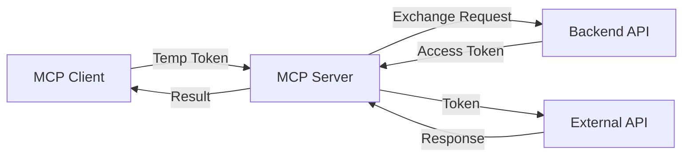


# OAuth Patterns Comparison Guide

This MCP server template supports two OAuth authentication patterns. This guide helps you choose the right pattern for your use case.

## Quick Decision Matrix

| Question | OAuth Passthrough | OAuth Backend |
|----------|------------------|---------------|
| Client has actual OAuth tokens? | ✅ Use this | ❌ |
| Need backend API for token exchange? | ❌ | ✅ Use this |
| Enterprise security requirements? | ❌ | ✅ Use this |
| Simple, direct token usage? | ✅ Use this | ❌ |
| Temporary token system? | ❌ | ✅ Use this |

## OAuth Passthrough Pattern

### When to Use
- ✅ Client already has OAuth access tokens
- ✅ Direct API access without intermediary
- ✅ Rapid prototyping and development
- ✅ Client-side OAuth flow implementation
- ✅ Simple authentication needs

### How It Works


### Implementation
```python
# Client sends actual OAuth token
_meta = {
    "oauth_tokens": {
        "github": "gho_actualGitHubToken123",
        "google": "ya29.actualGoogleToken456"
    }
}
```

### Pros
- Simple implementation
- No backend infrastructure needed
- Direct token usage
- Lower latency (no extra API call)

### Cons
- Client must manage OAuth flow
- Tokens exposed to MCP server
- No centralized token management
- Harder to revoke access

## OAuth Backend Pattern

### When to Use
- ✅ Enterprise security requirements
- ✅ Centralized token management
- ✅ Backend already handles OAuth
- ✅ Need token encryption/decryption
- ✅ Multi-tenant applications
- ✅ Compliance requirements (HIPAA, SOC2, etc.)

### How It Works


### Implementation
```python
# Client sends temporary token and identifiers
_meta = {
    "userId": "user_123",
    "tempToken": "temp_abc456",
    "providerId": "reddit"
}
```

### Pros
- Enhanced security (tokens never exposed to client)
- Centralized token management
- Easy token revocation
- Audit trail capability
- Backend controls token lifecycle

### Cons
- Requires backend API implementation
- Additional latency (token exchange)
- More complex architecture
- Backend must be highly available

## Side-by-Side Comparison

### Configuration

**OAuth Passthrough**:
```yaml
include_oauth_passthrough: yes
# No additional configuration needed
```

**OAuth Backend**:
```yaml
include_oauth_backend: yes
oauth_backend_url: "https://api.example.com"
oauth_backend_mock_mode: no
```

### Client Code

**OAuth Passthrough**:
```python
result = await session.call_tool(
    "get_github_user",
    arguments={},
    _meta={
        "oauth_tokens": {
            "github": "gho_actualToken123"
        }
    }
)
```

**OAuth Backend**:
```python
result = await session.call_tool(
    "get_reddit_user",
    arguments={},
    _meta={
        "userId": "user_123",
        "tempToken": "temp_token_abc",
        "providerId": "reddit"
    }
)
```

### Tool Registration

**OAuth Passthrough** (`app.py`):
```python
from tools.github_passthrough_tools import oauth_passthrough_tools
from decorators.oauth_passthrough import oauth_passthrough

for provider, tool_func in oauth_passthrough_tools:
    # ... decorator chain with oauth_passthrough
```

**OAuth Backend** (`app.py`):
```python
from tools.reddit_backend_tools import oauth_backend_tools
from decorators.oauth_backend import oauth_backend

for provider, tool_func in oauth_backend_tools:
    # ... decorator chain with oauth_backend
```

## Using Both Patterns

You can enable both patterns in the same server:

```yaml
include_oauth_passthrough: yes
include_oauth_backend: yes
oauth_backend_url: "https://api.example.com"
```

This allows:
- Different tools to use different patterns
- Gradual migration from one pattern to another
- Support for multiple client types
- Maximum flexibility

Example mixed usage:
- GitHub tools use passthrough (client has tokens)
- Reddit tools use backend (enterprise security)
- Google tools use passthrough (development)
- Microsoft tools use backend (production)

## Migration Strategies

### From Passthrough to Backend

1. **Enable both patterns** during transition
2. **Implement backend API** endpoint
3. **Update client** to send temp tokens instead of real tokens
4. **Test with mock mode** first
5. **Migrate tools** one provider at a time
6. **Disable passthrough** once migration complete

### From Backend to Passthrough

1. **Update client** to obtain real OAuth tokens
2. **Enable passthrough** pattern
3. **Create new tool files** using passthrough
4. **Test thoroughly** with real tokens
5. **Disable backend** pattern if no longer needed

## Security Considerations

### OAuth Passthrough
- ⚠️ Tokens visible to MCP server
- ⚠️ Client responsible for token security
- ⚠️ No centralized revocation
- ✅ Simple attack surface

### OAuth Backend
- ✅ Tokens never exposed to client
- ✅ Centralized security controls
- ✅ Easy revocation and rotation
- ⚠️ Backend API is critical infrastructure

## Performance Comparison

| Metric | Passthrough | Backend |
|--------|------------|---------|
| Latency | Lower | Higher (+1 API call) |
| Throughput | Higher | Lower |
| Complexity | Simple | Complex |
| Scalability | Client-limited | Backend-limited |

## Recommendations by Use Case

### Development/Prototyping
**Recommended**: OAuth Passthrough
- Quick setup
- No infrastructure needed
- Direct testing with tokens

### Enterprise Production
**Recommended**: OAuth Backend
- Centralized security
- Audit requirements
- Token lifecycle management

### Multi-tenant SaaS
**Recommended**: OAuth Backend
- Per-tenant token management
- Isolation between tenants
- Centralized monitoring

### Single-user Tools
**Recommended**: OAuth Passthrough
- Simple implementation
- User manages own tokens
- No backend needed

### Regulated Industries
**Recommended**: OAuth Backend
- Compliance requirements
- Audit trail necessity
- Security controls

## Testing Strategies

### OAuth Passthrough Testing
```bash
# Direct token testing
python test_oauth_passthrough.py gho_YOUR_TOKEN owner/repo
```

### OAuth Backend Testing
```bash
# Mock mode testing (no backend needed)
python test_oauth_backend.py

# Real backend testing
python test_oauth_backend.py --backend-url https://api.example.com --no-mock
```

## Troubleshooting Guide

### Common Passthrough Issues
- "No token provided" → Client must include token in `oauth_tokens`
- "Invalid token" → Token may be expired or revoked
- "403 Forbidden" → Token lacks required scopes

### Common Backend Issues
- "Missing parameters" → Ensure all three parameters provided
- "Provider mismatch" → `providerId` must match tool's provider
- "API timeout" → Check backend API availability
- "No backend URL" → Configure `oauth_backend_url`

## Conclusion

Both patterns are fully supported and can coexist. Choose based on your security requirements, infrastructure, and use case. Start with passthrough for simplicity, migrate to backend for production enterprise use.
